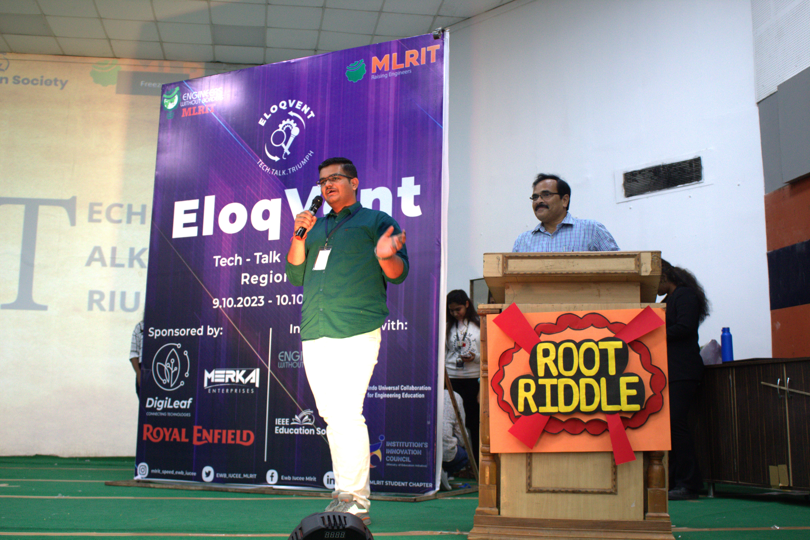

# 👋 Hi there, I'm Vedansh Sharma

<div align="center">
  
  
  
  
  
</div>

---

## 🚀 About Me



- 🎓 **3nd Year Computer Science Student** passionate about technology
- 🤖 Currently working as an **Software Development Intern**
- 🌱 Building projects with **MongoDB & Express.js**
- 👥 Open to collaborate on **MERN Stack Projects**
- 💼 Seeking **Software Engineer Intern** opportunities
- 📧 Reach me at: **svedansh0302@gmail.com**
- 🌐 Check out my work: **[Portfolio](https://vedanshsharma.works)**

<br clear="both"/>

---

## 🛠️ Tech Stack

<div align="center">

### Languages


### Frontend


### Backend & Database


### Tools & Technologies


</div>

---

## 📊 GitHub Analytics

<div align="center">
  
  
</div>

<div align="center">
  
</div>

---

## 🎯 Current Focus

```javascript
const vedansh = {
    currentRole: "AI Intern",
    currentlyLearning: ["MongoDB", "Express.js", "Machine Learning"],
    lookingFor: "Software Engineer Intern opportunities",
    collaboration: "MERN Stack Projects",
    hobbies: ["Coding", "Tech Exploration", "Problem Solving"]
};
```

---

## 🤝 Let's Connect

<div align="center">
  
[](https://www.linkedin.com/in/vedansh-sharmaa/)
[](https://vedanshsharma.works)
[](mailto:svedansh0302@gmail.com)

</div>

---

<div align="center">
  
</div>

<div align="center">
  
  **Thanks for visiting! 😊**
  
  ⭐️ **From [VedanshSharma53](https://github.com/VedanshSharma53)**
  
</div>
